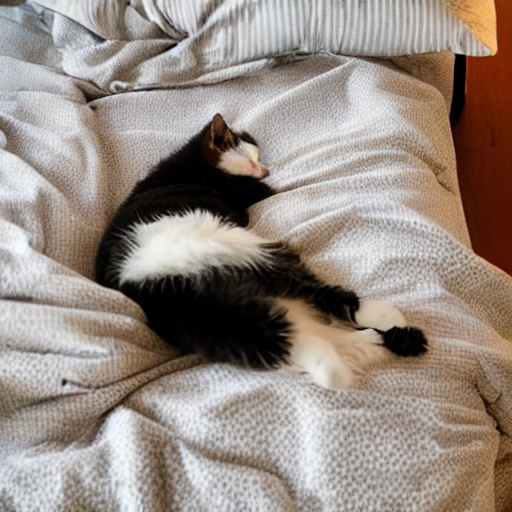
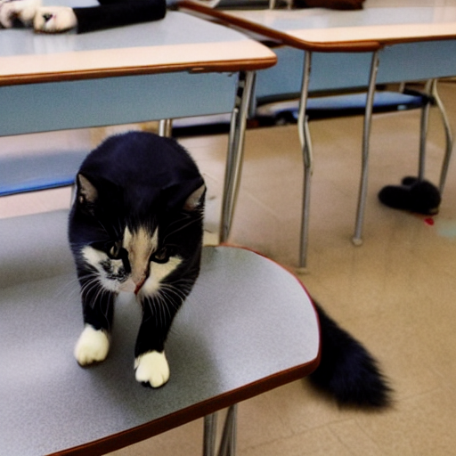
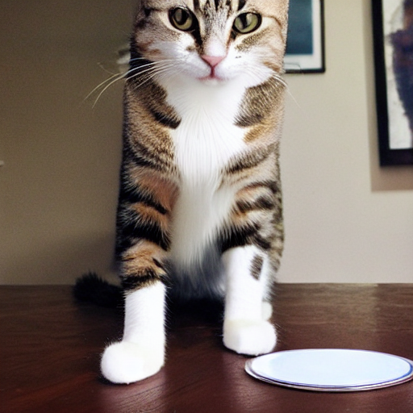
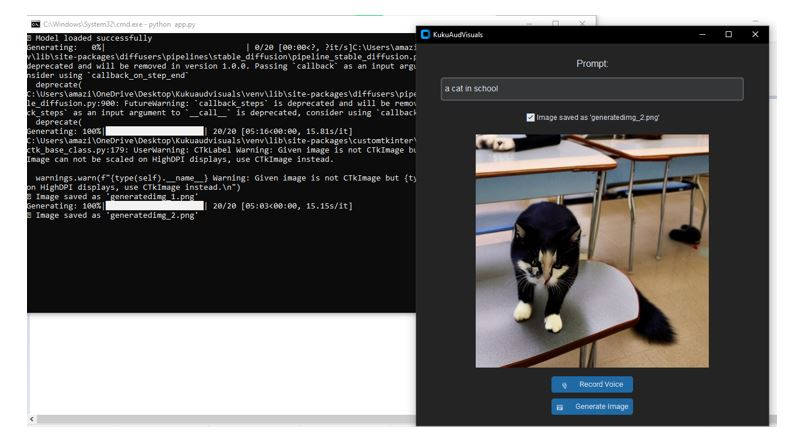
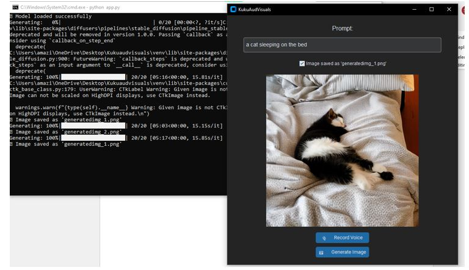

# 📽️ Kudvisuals

**Kudvisuals** is a Python-based prototype designed to **convert audio content (like podcasts and stories) into visuals** using generative AI. This helps audio platforms increase **user screen time** by offering visual engagement alongside audio content.

---

## 📸 Demo & Sample Outputs

- 🎞️ **[Project Demo Video](project demo video.mp4)** – Full walkthrough of the app.
- 🖼️ Sample generated images:
  - 
  - 
  - 

- 🔍 App screenshots:
  - 
  - 

---

## 💡 Objective

Audio platforms often struggle to retain users due to passive engagement. This tool **visualizes** the spoken content, helping:
- Increase screen time 📱
- Keep listeners more focused 🎧
- Make audio content shareable and immersive 📡

---

## ⚙️ Features

- 🎙️ **Voice-to-Text** via microphone
- 📝 Prompt box auto-filled by audio input
- 🖼️ Text-to-Image generation using Stable Diffusion
- 🪄 Clean GUI using `CustomTkinter`
- 💾 Saves all generated visuals as PNG files
- 🔧 Uses `FFmpeg` (bundled) for audio backend functionality

---

## 🧪 Microphone Setup

Before running the app, test your microphone:

```bash
python mictest.py
```

🔎 Check the printed list and update this in `app.py`:

```python
with sr.Microphone(device_index=2) as source:
```

Replace `2` with your actual mic index.

---

## 🚀 Getting Started

> 📌 Requires **Python 3.10**  
> 💾 Needs ~4GB free space (for model) and an active internet connection (only for first use)

### 1. Clone the Repository

```bash
git clone https://github.com/yourusername/Kudvisuals.git
cd Kudvisuals
```

### 2. Create and Activate Virtual Environment

```bash
python -m venv venv
venv\Scripts\activate  # For Windows
```

### 3. Install Dependencies

```bash
pip install -r requirements.txt
```

> 💡 If any installation fails, install packages one-by-one.

---

## 🧨 Torch Installation (Offline or Manual)

If `torch` fails to install via `pip`, use the provided `.whl` file:

```bash
pip install torch-1.12.1+cpu-cp310-cp310-win_amd64.whl
```

Make sure you're using **Python 3.10 64-bit**.

---

## 🧠 How It Works

1. Press **🎙️ Record Voice** to capture audio.
2. Converts audio to text using `SpeechRecognition` (FFmpeg backend).
3. Press **🖼️ Generate Image** to generate visuals using Stable Diffusion.
4. Image is displayed + saved automatically.

---

## 📂 Model Download Path

On first run, if no local model is found, the Stable Diffusion model will be downloaded from Hugging Face.  
It will be stored in a default cache path like:

```
C:\Users\<your-username>\.cache\huggingface\hub\models--runwayml--stable-diffusion-v1-5
```

You can move or copy it to a folder named `stable-diffusion` in your project directory to avoid redownloading.

---

## 📁 Project Structure

```
Kudvisuals/
│
├── app.py                      # Main app interface
├── mictest.py                  # Mic testing script
├── requirements.txt            # Python dependencies
├── torch-1.12.1+cpu-...whl     # Torch install file (optional)
├── project demo video.mp4      # App demo video
├── generatedimg_1.png          # Sample generated image
├── generatedimg_2.png
├── generatedimg_3.png
├── samplelook1.JPG             # Screenshot - App GUI
├── samplelook2.JPG             # Screenshot - Model Ready
├── ffmpeg/                     # FFmpeg executables
│   ├── ffmpeg.exe
│   ├── ffplay.exe
│   └── ffprobe.exe
└── stable-diffusion/           # (Optional) Local model folder
```

---

## 👨‍💻 Author

Created by **Shantanu Anand**  
🎯 GenAI Project – Visualizing audio for better engagement and retention.
